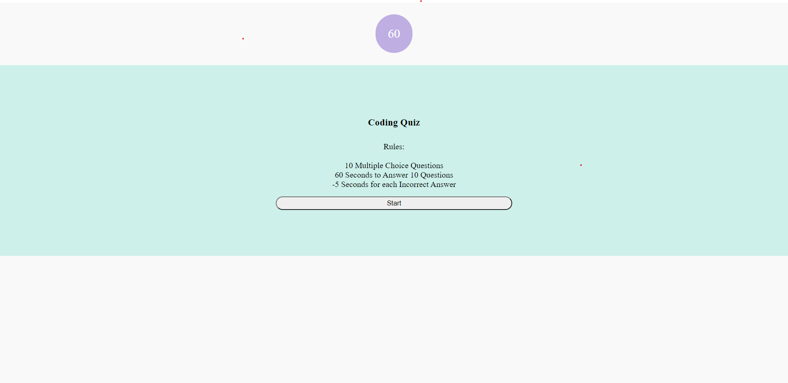

# BC-HW-4
Coding Quiz Web App

Deployed Site:
https://tonyavall.github.io/BC-HW-4/

Stack:
HTML, CSS, Javascript

Logic Map: 

1. Coding Quiz Start Page 
    a. On click 'start', timer starts -> question 1 
2. Uppon answering question -> Presented with another question
    a. Carousell concept?
3. If incorrect answer -> time--
4. Game over if
    a. all questions answered
    b. t = 0
5. When game over -> save my initials and score
    a. user string input
    b. display correct out of incorrect
6. Go back and clear score button

Approach: Html orriented. Could do javascript objects as questions.

Concept Abstract: Default class 'hidden' has css property display: none; for quiz container. A position listener function grabs current index. Whatever index is not current index is given class hidden and the current index will have class hidden removed.

1. 10 Different Questions via html
    a. Header
    b. 4 Buttons with boolean attribute 'correct'
2. 10 questions are hidden via carousell -> no backwards navigation
    a. index 1-10 -> data-index attribute 1-10 values
    b. on click index++ -> if index > 10 return insert initials page
3. Default css class = hidden
4. When done with base functions, could add question randomizer and/or answer randomizer.
    a. Based on data-question attribute manipulation

Global Variables:

1. time
2. correct
4. index

Project Notes:

1. I ended up making 2 functions that are responsible for the showing and hiding of current node and noncurrent node.
    a. currentIndex(); grabs current node
    b. posListener(); associates index variable with node dataset attribute index value.
    c. If I want to change the index variable value I can then just use the posListener to change current node

2. For future reference: This project is not scalable. What I could do differently - More javascript orriented where the questions are stored as an array of objects. This allows me to have data for the correct answer that is a serverside request, making it hard to cheat. Allows for an easier randomization of questions and answers. Allows for a 'question bank' concept. Allows for custom questions and answers stored by the user, etc.
